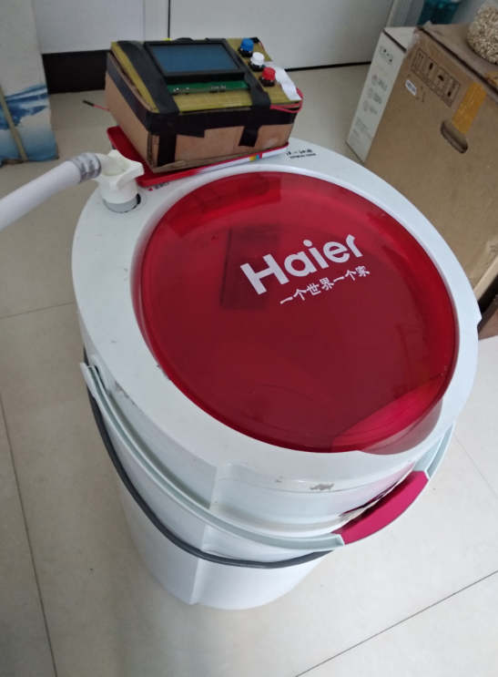

# washer
500元打造弱智能洗衣机

目的：
实现以下功能：
多方案选择
按程序执行注水、洗涤、排水、漂洗

材料：
Arduino 开发板
4路继电器
按键 * 3
水位传感器
控水阀 * 2
音乐播放模块/蜂鸣器
SD卡
WiFi模块/GSM模块

注意：
注水出现问题能有完善的处理方案
按键重复输入、间隔输入等方案不人性化

【解决】

【优化】
程序优化：
	减少阻塞，将洗涤的6s分段

	3.显示屏优化
		一直显示 zhushui...
		没显示倒计时（次数）	√

	2.旋转时间优化			√
	排水时间加长				√

水位高
水位传感器保护
1、控制面板固定支架
2、水位传感器进水...（已改进为泡沫+牙签，更大的体积却只有0.5g，而3D打印的有3g+，差不多等于排开液）

2、排水管与水阀连接			√
	水管内径：2.1-2.3
	水阀：2.2	外径 2.65
3、固化中控台					√
4、排水时间					√
侧边挂钩						√
